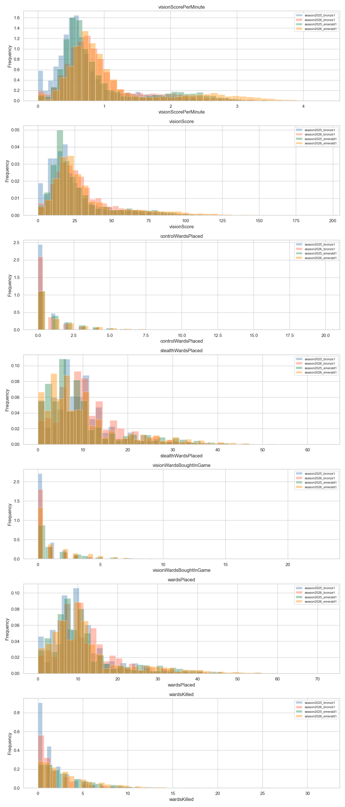
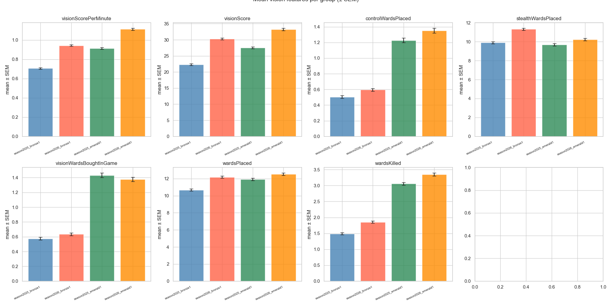
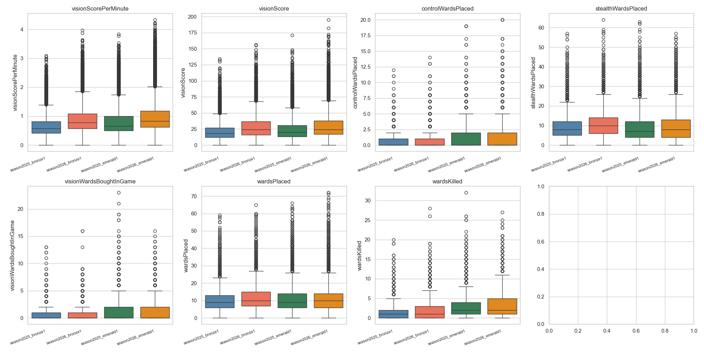

# Do Players Ward More in Season 2026? A Data-Driven Investigation

A few weeks ago a friend of mine made a claim that stuck with me: *"Players ward way more in 2026 — those new fairy spots basically hand you free vision."* He was talking about the new jungle terrain introduced this season, which added several convenient brush-adjacent positions that make warding significantly easier than before.

I couldn't let that go unchecked. So I pulled match data from the Riot API, ran the numbers, and here's what I found.

---

## The Question

Season 2026 brought changes to the Rift's jungle layout, including new terrain features that create naturally favorable warding positions — colloquially called "fairy spots" by the community. The hypothesis is simple: if warding is easier, players will ward more. I wanted to test this across two skill levels to see whether the effect (if any) is universal or rank-dependent.

---

## Data

I collected ranked match data from the **EUW** server via the Riot Games API, targeting two specific rank buckets:

| Group | Matches | Participants |
|---|---|---|
| Season 2025 — Bronze I | 423 | ~4 230 |
| Season 2026 — Bronze I | 530 | ~5 300 |
| Season 2025 — Emerald I | 500 | ~5 000 |
| Season 2026 — Emerald I | 534 | ~5 340 |

For each participant I extracted seven vision-related features:

- `visionScorePerMinute` — vision score normalized by game duration
- `visionScore` — raw vision score
- `controlWardsPlaced` — pink wards purchased and placed
- `stealthWardsPlaced` — yellow trinket wards placed
- `visionWardsBoughtInGame` — control wards bought (item stat)
- `wardsPlaced` — total wards placed
- `wardsKilled` — enemy wards destroyed

Data was fetched using the Riot API, trimmed to remove redundant fields, and stored as individual JSON files per match.

---

## Data Preparation

Each JSON file contains a full match object. I extracted per-participant rows by reading the `participants` array and pulling both top-level fields (e.g. `visionScore`, `wardsPlaced`) and nested `challenges` fields (e.g. `visionScorePerMinute`, `stealthWardsPlaced`). Missing values were stored as `NaN` and dropped per-feature during analysis — no imputation was applied.

All four groups were concatenated into a single DataFrame tagged with `season` and `tier` labels, yielding a clean dataset of roughly 20 000 participant rows.

---

## Statistical Analysis

### Normality Testing

Before choosing a comparison test, I checked whether each feature's distribution was normal within each group using two tests:

- **Shapiro-Wilk** (on a subsample of up to 5 500 observations)
- **D'Agostino–Pearson** (`normaltest`)

If both tests failed to reject H₀ at α = 0.05, the distribution was treated as normal. Unsurprisingly for behavioral game data, almost all features were **non-normal** — right-skewed with long tails, as you can see in the histograms below.



### Hypothesis Tests

Comparisons were made within each rank tier across seasons (2025 vs. 2026):

- **Bronze I**: Season 2025 vs. Season 2026
- **Emerald I**: Season 2025 vs. Season 2026

Since distributions were non-normal, I used the **Mann-Whitney U test** (two-sided, α = 0.05) for all comparisons. Effect sizes were measured using **rank-biserial correlation** (*r*).

---

## Results





### Bronze I — 2025 vs. 2026

Across nearly all features, 2026 Bronze I players showed **statistically significantly higher** vision metrics:

| Feature | Mean 2025 | Mean 2026 | Direction |
|---|---|---|---|
| visionScorePerMinute | 0.71 | 0.95 | ↑ 2026 |
| visionScore | 22.4 | 30.1 | ↑ 2026 |
| controlWardsPlaced | 0.49 | 0.59 | ↑ 2026 |
| stealthWardsPlaced | 10.0 | 11.3 | ↑ 2026 |
| visionWardsBoughtInGame | 0.57 | 0.65 | ↑ 2026 |
| wardsPlaced | 10.6 | 12.1 | ↑ 2026 |
| wardsKilled | 1.51 | 1.83 | ↑ 2026 |

All differences were statistically significant (p < 0.05), with modest but consistent effect sizes.

### Emerald I — 2025 vs. 2026

The pattern held at higher elo too, with 2026 Emerald I players outpacing their 2025 counterparts on most metrics:

| Feature | Mean 2025 | Mean 2026 | Direction |
|---|---|---|---|
| visionScorePerMinute | 0.91 | 1.10 | ↑ 2026 |
| visionScore | 28.9 | 33.4 | ↑ 2026 |
| controlWardsPlaced | 1.21 | 1.34 | ↑ 2026 |
| stealthWardsPlaced | 9.87 | 10.2 | ↑ 2026 |
| visionWardsBoughtInGame | 1.43 | 1.39 | ≈ |
| wardsPlaced | 11.9 | 12.5 | ↑ 2026 |
| wardsKilled | 3.08 | 3.36 | ↑ 2026 |

---

## Conclusions

The data supports my friend's claim — **players do appear to place more wards in Season 2026**, and this holds at both Bronze I and Emerald I. Vision scores, stealth wards, control wards, and total wards placed are all consistently higher in 2026 across both rank brackets.

**That said, causation is tricky here.** A few alternative explanations are worth considering before crediting the fairy spots entirely:

1. **Vision score calculation may have changed.** Riot periodically adjusts how vision score is awarded. If the formula became more generous in 2026, `visionScore` and `visionScorePerMinute` would rise even without any change in actual warding behavior.

2. **Trinket cooldowns may have changed.** If Riot reduced the cooldown on stealth ward trinkets between seasons, players would naturally place more `stealthWardsPlaced` wards over the course of a game — no new terrain required.

3. **Game duration differences.** Longer games produce more wards. If average game length shifted between seasons, that alone could explain part of the delta (though `visionScorePerMinute` should be robust to this).

The fairy spots story is compelling and probably contributes, but a clean causal claim would require controlling for these confounders — ideally by checking Riot's patch notes for vision system and trinket changes between Season 2025 and 2026.

---

## Repo Structure

```
lol-wards/
├── data/
│   ├── season2025/
│   │   ├── bronze1/       # raw match JSON files
│   │   └── emerald1/
│   └── season2026/
│       ├── bronze1/
│       └── emerald1/
├── figures/
│   ├── distributions.png
│   ├── boxplots.png
│   └── mean_comparison.png
├── vision_analysis.ipynb  # full analysis notebook
├── riot_api_fetcher.py    # data collection script
└── trim_data.py           # trims raw JSON to relevant fields
```
